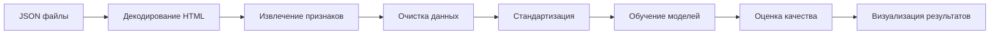

# 🎨 Анализатор качества макета

> **Автоматическая оценка качества HTML-макетов с помощью машинного обучения**

[](https://www.python.org/)
[](LICENSE)
[]()

---

## 📖 О проекте

**Анализатор качества макетов** — это интеллектуальная система для автоматической классификации HTML-макетов (веб-страниц, презентаций, email-шаблонов) на категории **«хорошие»** и **«плохие»**.

Проект анализирует **HTML-код** и извлекает более **100+ признаков**, включая:
- 🏗️ **Структурные** — количество тегов, ссылок, плотность элементов
- 🎨 **Стилевые** — размеры шрифтов, отступы, повороты, цвета
- 📝 **Текстовые** — объём контента, распределение текста

Для классификации применяются современные алгоритмы машинного обучения: **Random Forest**, **Gradient Boosting**, **Logistic Regression** и **KNN**.

---

## 🏆 Результаты моделирования

| Модель              | Accuracy | Precision | Recall | F1-score | ROC-AUC |
|---------------------|----------|-----------|--------|----------|---------|
| **Random Forest**   | **0.97** | **0.97**  | **0.97** | **0.97** | **0.99** |
| **Gradient Boosting**| **0.97** | **0.97**  | **0.97** | **0.97** | **1.00** |
| Logistic Regression | 0.89     | 0.88      | 0.89   | 0.88     | 0.95    |
| KNN                 | 0.85     | 0.84      | 0.85   | 0.84     | 0.92    |

> 💡 **Почему такие высокие метрики?**  
> Тщательно спроектированные признаки позволяют моделям чётко разделять классы даже на небольшой выборке (120 макетов). Ансамблевые методы показывают наилучшую стабильность при кросс-валидации.

---

## 🔍 Ключевые признаки

Модель определяет качество макета на основе следующих характеристик:

| Признак | Описание | Важность (RF) |
|---------|----------|---------------|
| `link_count` | Количество ссылок `<a>` на странице | **27.9%** |
| `width_min` | Минимальная ширина элементов (px) | **20.6%** |
| `total_text_length` | Общий объём текстового содержимого | **17.0%** |
| `font-size_mean` | Средний размер шрифта (px) | **16.6%** |
| `height_mean` | Средняя высота элементов (px) | **8.2%** |
| `rotate_mean` | Средний угол поворота элементов (deg) | **4.9%** |
| `line-height_mean` | Средний межстрочный интервал | **4.7%** |

### 📊 Дополнительные признаки:
- `entity_count` — количество контентных блоков
- `absolute_position_count` — использование абсолютного позиционирования
- `border_radius_count` — наличие скруглений
- `unique_colors` — разнообразие цветовой палитры
- `padding_count`, `background_count` — характеристики оформления
- `has_default_entity` — наличие элементов по умолчанию
- И многие другие CSS-свойства (height, width, font-size, color, transform...)

---

## 📁 Структура проекта

```
layout-quality-analyzer/
│
├── 📂 data/
│   ├── raw/
│   │   ├── good.json           # HTML-код «хороших» макетов (60 шт.)
│   │   └── bad.json            # HTML-код «плохих» макетов (60 шт.)
│   └── processed/
│       └── features.csv        # Извлечённые признаки
│
├── 📂 src/
│   ├── __init__.py
│   ├── data_loader.py          # Загрузка и декодирование JSON
│   ├── feature_extractor.py    # Извлечение 100+ признаков из HTML
│   ├── preprocessing.py        # Очистка, удаление корреляций, стандартизация
│   ├── model.py                # Конфигурация моделей ML
│   ├── train.py                # Обучение и кросс-валидация
│   ├── evaluation.py           # Расчёт метрик, важность признаков
│   └── visualization.py        # Графики: боксплоты, heatmap, importance
│
├── 📂 notebooks/
│   └── Untitled24.ipynb        # Полное EDA, визуализация, эксперименты
│
├── 📄 requirements.txt         # Зависимости Python
├── 📄 main.py                  # Точка входа: запуск пайплайна
├── 📄 Dockerfile               # Контейнеризация проекта
├── 📄 .dockerignore
├── 📄 .gitignore
└── 📄 README.md                # Этот файл
```

---

## ⚙️ Как это работает

### Пайплайн обработки данных:



### Этапы обработки:

1. **Загрузка данных**  
   Чтение JSON-файлов с HTML-контентом макетов

2. **Декодирование HTML**  
   Преобразование HTML-сущностей (`&lt;`, `&gt;`, `&quot;`) в читаемый формат

3. **Извлечение признаков**  
   - Парсинг HTML через BeautifulSoup
   - Анализ структуры (теги, ссылки, блоки)
   - Извлечение CSS-свойств (размеры, цвета, отступы)
   - Расчёт статистик (min, max, mean, var)

4. **Предобработка**  
   - Удаление дублирующихся признаков
   - Фильтрация сильно коррелирующих переменных (|corr| > 0.9)
   - Стандартизация числовых признаков (StandardScaler)

5. **Обучение моделей**  
   - Train/Test split (80/20)
   - 5-fold кросс-валидация
   - 4 модели: RF, GB, LR, KNN

6. **Оценка и визуализация**  
   - Метрики: Accuracy, Precision, Recall, F1, ROC-AUC
   - Feature Importance анализ
   - Boxplot распределений признаков
   - Heatmap корреляций

---

## 🚀 Быстрый старт

### Вариант 1: Локальный запуск

```bash
# Клонируем репозиторий
git clone https://github.com/oliviadebirs/layout-quality-analyzer.git
cd layout-quality-analyzer

# Создаём виртуальное окружение
python -m venv venv

# Активируем (Linux/Mac)
source venv/bin/activate
# Или (Windows)
venv\Scripts\activate

# Устанавливаем зависимости
pip install -r requirements.txt

# Запускаем пайплайн
python main.py
```

### Вариант 2: Docker

```bash
# Клонируем репозиторий
git clone https://github.com/oliviadebirs/layout-quality-analyzer.git
cd layout-quality-analyzer

# Собираем образ
docker build -t layout-analyzer .

# Запускаем контейнер
docker run --rm layout-analyzer
```

---

## 📦 Зависимости

Основные библиотеки:

| Библиотека | Назначение |
|------------|------------|
| `pandas`, `numpy` | Работа с данными |
| `beautifulsoup4` | Парсинг HTML |
| `scikit-learn` | Модели машинного обучения |
| `matplotlib`, `seaborn`, `plotly` | Визуализация |
| `jupyter` | Интерактивные ноутбуки |

Полный список в [`requirements.txt`](requirements.txt).

---

## 📊 Примеры данных

### Хорошие макеты (`good.json`)
✅ Чёткая структура  
✅ Сбалансированное использование пространства  
✅ Гармоничные размеры элементов  
✅ Оптимальное количество ссылок  

### Плохие макеты (`bad.json`)
❌ Хаотичная компоновка  
❌ Экстремальные значения размеров  
❌ Недостаток/переизбыток контента  
❌ Проблемы с читаемостью  

> 📌 *Презентации макетов доступны по запросу.*

---

## 🧪 Исследования в Jupyter Notebook

В проекте доступен подробный ноутбук [`Untitled24.ipynb`](Untitled24.ipynb), содержащий:

- 📈 Разведочный анализ данных (EDA)
- 🔬 Детальный анализ признаков
- 📉 Визуализацию распределений (boxplots)
- 🔥 Heatmap корреляций
- 🎯 Анализ важности признаков (Feature Importance)
- 📊 Сравнение моделей
- 💬 Интерпретацию результатов

---

## 🎯 Выводы исследования

1. **Ансамблевые методы** (Random Forest, Gradient Boosting) показывают наилучшие результаты (~97% accuracy) благодаря способности улавливать сложные нелинейные зависимости между признаками.

2. **Ключевые факторы качества**:
   - Количество ссылок (`link_count`) — наиболее значимый признак
   - Минимальная ширина элементов (`width_min`) — важный структурный параметр
   - Объём текста (`total_text_length`) — показатель наполненности макета
   - Размер шрифта (`font-size_mean`) — влияет на читаемость

3. **Декоративные признаки** (повороты, line-height) имеют второстепенное значение, что логично для задачи оценки базового качества компоновки.

4. **Высокие метрики** объясняются:
   - Информативностью извлечённых признаков
   - Чёткой разделимостью классов в датасете
   - Корректной предобработкой данных

---

## 🤝 Вклад в проект

Проект открыт для улучшений! Вы можете:
- Предложить новые признаки для анализа
- Добавить дополнительные модели (XGBoost, LightGBM, нейросети)
- Улучшить визуализацию результатов
- Расширить датасет новыми макетами

---

## 📄 Лицензия

MIT License — свободное использование с указанием авторства.

---

## 👤 Автор

**Olivia Debirs**  
[GitHub](https://github.com/oliviadebirs/layout-quality-analyzer)

---

<div align="center">

**Если проект оказался полезным — поставьте ⭐ на GitHub!**

Made with ❤️ and Machine Learning

</div>
